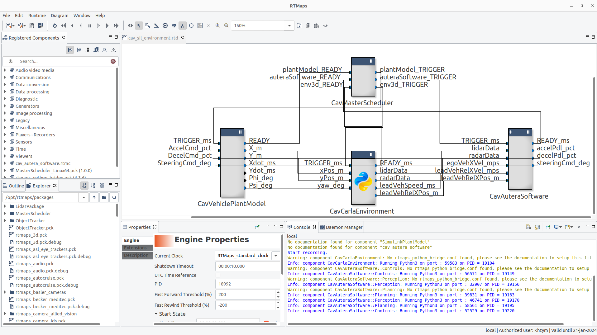

# CAV SIL Environment

Clone using this command: `git clone https://github.com/SamKhzym/CavDevChallenge2023.git`

This repository contains the software-in-loop (SIL) testing environment for the McMaster EcoCAR Connected and Automated Vehicles team. The intent of this project is to contain the vehicle plant model, environment, and simulated sensors that mimic the behavior of the real vehicle. It is written in a combination of Python and C++ components, with the middleware being handled in RTMaps. To run this, open `cav_sil_environment.rtd` in RTMaps, configure your appropriate Python bridge and locations to your RTMaps components, then click the "Run" button. Make sure a [CARLA](documentation/running_carla.md) server is running before beginnning the RTMaps simulation. For more information for running the SIL environment, look at [Running on Windows 11](documentation/running_on_windows.md)

# Repository Components

This repository can be broken down into four major components:

### cav-autera-software

This is a submodule (repo within a repo) which contains the production software that will be run on the primary CAV compute unit (dSPACE Autera). The idea is that this can be run completely virtually without any dependencies on the hardware and be configured to run in the SIL environment. This is currently being implemented as a macro-component that is registered in the SIL environment diagram.

### cav-carla-env

This is a Python RTMaps component which contains the setup code to spawn all actors into a CARLA environment and place the ego vehicle dynamically in it based on the outputs of our software. It also contains the simulated sensors (LiDAR, radars, cameras) which will output perception information to the production software stack.

### cav-plant-model

This is a Simulink model which has been codegenned and placed in a C++ RTMaps component wrapper. It provides the vehicle plant model which will simulate the physics of the vehicle when given an acceleration, brake, and steering command. For now, its inputs are pedal positions and steering wheel angle, but this will be changed to what our controller will command (positive/negative longitudinal torque, steering column torque).

### cav-master-scheduler

RTMaps C++ component which handles the synchronization and time execution of the SIL simulation.

# Dependencies

1. RTMaps: Please request a student licence for RTMaps and install it from .  
2. (STRONGLY RECOMMENDED) Anaconda: used to manage your Python environments. For Carla, we've set up everything in Python 3.7 which has been pretty stable.
3. CARLA with all Python dependencies installed [[Linux installtion set-up]](documentation/linux_carla_setup.md) [[Windows installation set-up]](documentation/windows_carla_setup.md)
4. Additional Python packages: `pip install -r requirements.txt`.   
Ensure that the installed version of CARLA matches the version of the CARLA package within the `requirements.txt`. If required, modify the `requirements.txt` to make it match.
	
