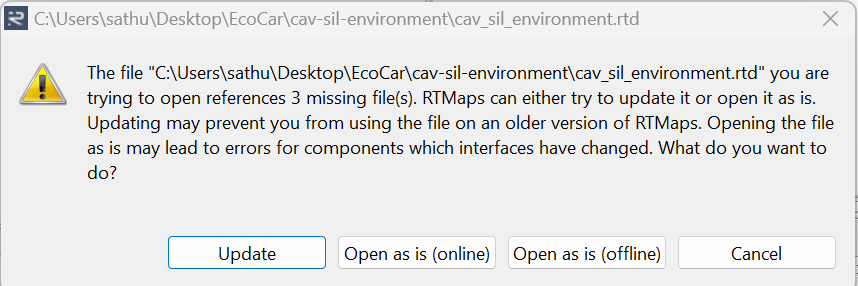
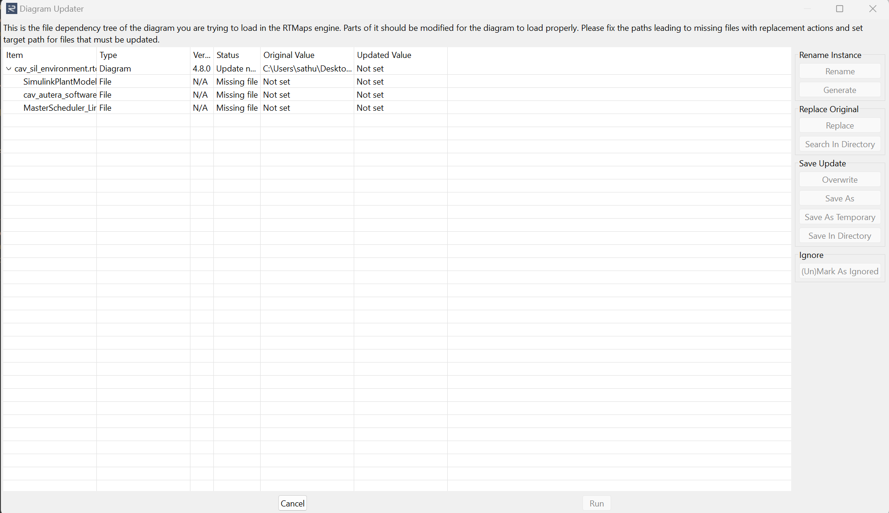
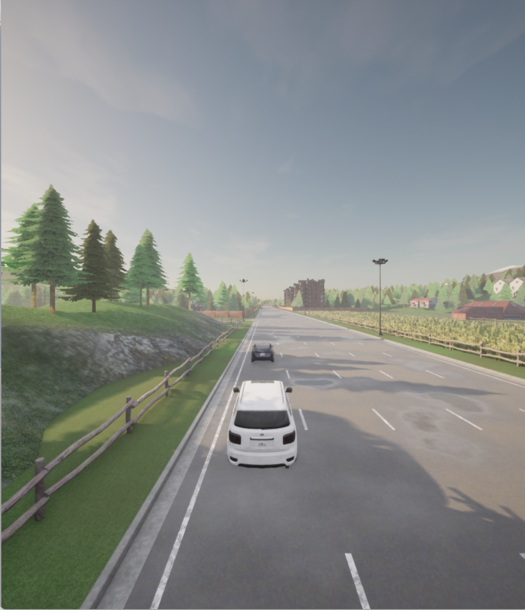

# Running the SIL Environment in Windows 11 64 bit Machine
## Background
There are different setups required before you can run the SIL environment. This is because different packages exist between different OS systems and various paths for individual computers. This instruction will provide information on starting up the SIL environment on a Windows 11 computer **every time you pull from the repository** as settings are reset to the default each time. Later pipelines will solve this issue, but is not a high priority at the moment. 

## Requirements
- cavs-sil-environment repository pulled onto your system
- RTMaps Studio
- Carla 0.9.14 downloaded along side with additional assets (maps)
- python 3.7 installed (preferably  use Anaconda)
- pulled from git using `git pull --recurse-submodules` from the main directory

Note: Ensure you have followed the [Windows installation set-up](windows_carla_setup.md)

## Steps
1. Open RTMaps Studio. 
2. Click on File->Open->Open Diagram (online).
3. Find the root directory of cav-sil-environment and open `cavs_sil_environment.rtd`
4. A pop-up may appear about three missing files. The missing files need to be redefined for your operating system. Click on `Update` if the pop-up appears, else skip to step 8

5. For each missing file, the Status column will say `Missing file`. For each file, click on "Missing file", and then click on `Replace` on the right side of the Diagram Updater. Then open the corresponding file, the file should end with `Win64.pck`. Below will tell you which files to replace.

   - Replace `SimulinkPlantModel_Linux64.pck` with `cav-plant-model/rtmaps/bin/SimulinkPlantModel_Win64.pck`
   - Replace `MasterScheduler_Linux64.pck` with `cav-master-scheduler/bin/MasterScheduler_Win64.pck`
6. Click on the cav_sil_environment.rtd row.
7. Click on `Overwrite` on the right side of the Diagram Updater. Then click on `Run` at the bottom of the Diagram Updater
8. Once the diagram is loaded in RTMaps (may take a few seconds), click on the `CavCarlaEnvironment` block.
9. The Properties window shows the properties of the python bridge block (the one you just clicked on). The `Python Executable` needs to be updated. Open Anaconda Prompt on Windows and run the following command
`conda activate carla`
`where python`
10. Copy and paste the python.exe path to "Python Exectable" property as explained in step 9. If there are multiple python executable paths, use the one that has "carla" as one of the parent folders (this is the python executable specific to the virtual environment for Carla that you created before). See the Tip 1 below. 
11. Update the python executable for the `CavAuteraSoftware` block
12. Save your changes
13. Run [Carla](running_carla.md).
14. Run the RtMaps diagram by clicking the run button (looks like a power on/off button near the top left of the window)

**Tip 1:** If any anaconda terminal pops up, avoid closing them, or else you will get `python is not responding` error and the SIL environment may not work.
 